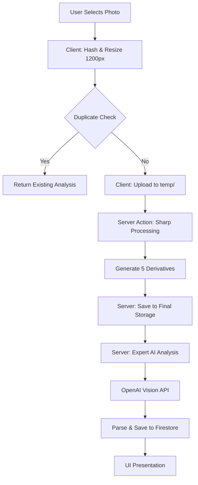

# Viewora AI Photo Analysis Pipeline (v1.0) 📸

This document outlines the technical steps and optimizations involved in the AI-powered photo analysis flow.

## 🏗️ Architecture Overview

The pipeline is split between **Client-side** (immediate feedback & optimization) and **Server-side** (heavy processing & AI logic) to ensure maximum speed and stability.

## ⏱️ Performance Targets
- **Target Duration:** 10 - 15 Seconds
- **Current Record:** ~10.7 Seconds 🚀

---

## 📝 Step-by-Step Breakdown

### 1. Client-Side Optimization (The "Speed Secret")
- **Hashing:** Generates a SHA-256 fingerprint for deduping to save Pix credits.
- **Smart Resizing:** Photos are scaled to **1200px** (max dimension) at **85% quality** before leaving the browser. 
- **Benefit:** Reduces 11MB RAW files to ~300KB payloads, cutting upload time by up to 90%.

### 2. Duplicate Detection
- Checks `users/{uid}/photos` for matching hashes. If found, reuses existing analysis instantly.

### 3. Server-Side Processing (The "Sharp" Engine)
- Use **Sharp** for high-performance image manipulation.
- **Auto-Rotation:** Corrects EXIF orientation issues (common in iPhone HEIC photos).
- **Concurrency:** Generates 5 versions simultaneously (Thumbnail, Feature, Detail, Watermarked, Analysis).

### 4. Expert AI Analysis (The "Brain")
- **Security:** Uses Firebase Admin **Signed URLs** to grant temporary, secure access to OpenAI.
- **Model:** `gpt-4.1-mini` with a specialized "Photography Coach" system prompt.
- **Extraction:** Returns structured JSON including Light, Composition, Storytelling scores, and professional Turkish critique.

### 5. Finalization
- **Deduction:** Deducts Pix cost based on the user's Tier.
- **Indexing:** Updates the user's "Global Technical Index" in Firestore.

---

## 🛠️ Tech Stack
- **Sharp:** Image processing.
- **Firebase Storage & Firestore:** Data storage.
- **OpenAI Node SDK:** Vision API.
- **Next.js Server Actions:** Secure pipeline execution.

---
> *Documented with ❤️ by the Viewora Engineering Team.*
